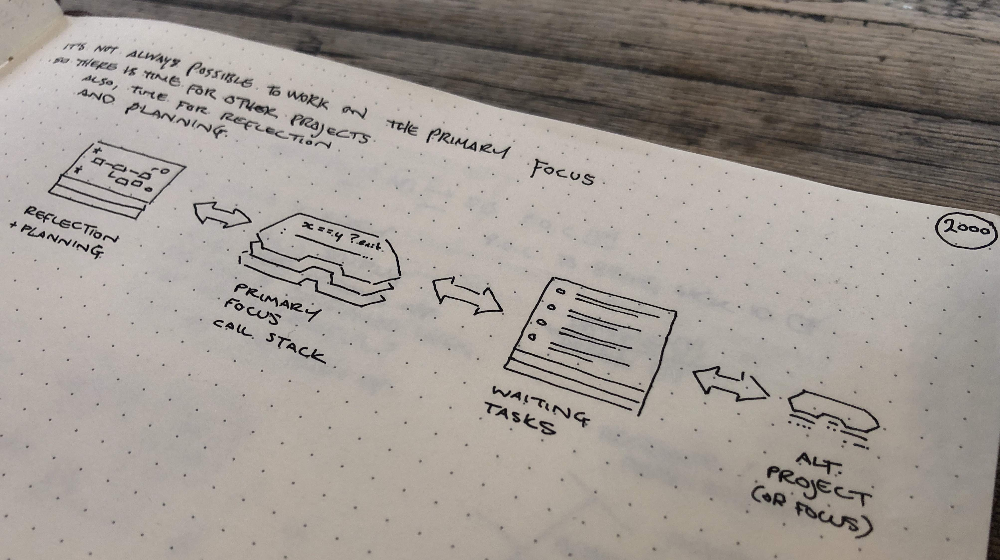

This post developed out of something first noted on **DC5B Described > [Weekly update 2022-09-07](https://dc5b.dog/2022/09/07/weekly-update/)**. [DC5B](https://dc5b.com/) is my personally business for turning my creative ideas into money. It's a project in its first year that I will grow alongside my work as a software consultant (business developer).

Between April and October I was getting coaching from a master of NLP (neuro-linguistic-programming) which focused on this hypothetical business exploration. Since the first few weeks it has been apparent that we would be working on a project that underlies the development of **DC5B**. How I plan, operate and improve in order to start a business is clearly a question whose answer dictates the rest of my life. Let's have a example to illustrate that point:

The process for building motivation around the business involves identifying what I want and how I'm going to get it. Getting skilled at asking and answering those kinds of questions for myself might help me set up my own side-hustle, and it also enhances my ability to develop other peoples' businesses and plan and deliver their projects.

The breakthroughs that I have experienced in terms of clarity of thought, frank communication, extreme ownership of my feelings, actions and thoughts and refactoring of my own neurological processes have been beneficial to many professional and personal aspects of my life.

At the time that of [that weekly update](https://dc5b.dog/2022/09/07/weekly-update/) I was working on my operational guidelines. Guidelines for answers common working dilemmas.

That feeling has remained as I've been putting the guidelines to the test. Rehearsing ways to organise, focus and make decisions at speed.

My primary focus has been some database and like button work. I've remained single threaded and goal minded. When it's not been possible to work on it fully, e.g. journey time without a networked laptop, I've transitioned to planning, design or small waiting tasks and been able to switch back easily once the conditions allow it.

## T.O.T.E. Model

By “TOTE" I'm referring to “Test operate test exit”. I can't find a great link for explaining this so I'll describe what it means to me here:

I've been working with the idea of call-stacks to keep my low level goals in mind whilst working on high level details. Another analogy could be nested loops but I prefer software analogies at this time because they are kept _warm_ by my day-to-day work.

The TOTE model gives us a process by which we work to satisfy a test. Once the desired state is the current state the test passes and we exit. In a call stack when a loop exits, or a “function returns”, we continue processing from the point at which we started the loop, or _called the function_.

**The advantages are numerous:**

1. Knowing the desired state throughout keeps us on track,

1. Knowing the point of the calling function shows us where to return to when we've achieved what we desired,

1. We can go into detail to achieve a specific desire, whilst keeping in memory the sequential steps that led from and lead us back to the more fundamental desire.

## Changing between primary focus, planning and reflection

In the above image I'm designing places for things outside of the primary focus. Recognising that the primary focus will get interrupted at times (e.g. when the database work needs me to be at a laptop and online), I'm offering options for what to bring into view when I put that to one side (e.g. while I'm on a screen break but otherwise ready to work).

Interestingly the closest options (left and right off the primary focus) are not alternative projects, they are reflection, planning and adhoc waiting tasks. I've found these to be easy to put-back-to-one-side when the primary focus is available again.

## The main thread analogy

Last week I celebrated "keeping my main thread moving and directing arising thoughts to a background process". This week I'm talking about call-stacks, available resources and sub-routines.

These software metaphors really work for me because they provide simple but effective ways of being from a rich territory that is very familar to me. To note down distractings and consider them later is not rocket science but following this process rather than not has been massively effective.

As someone who uses this kind of language in my day job, talking about how operate myself like I'm running a carefully designed computer program encourages me to respect the process and to execute it without deviation. Basically, it works for me.
