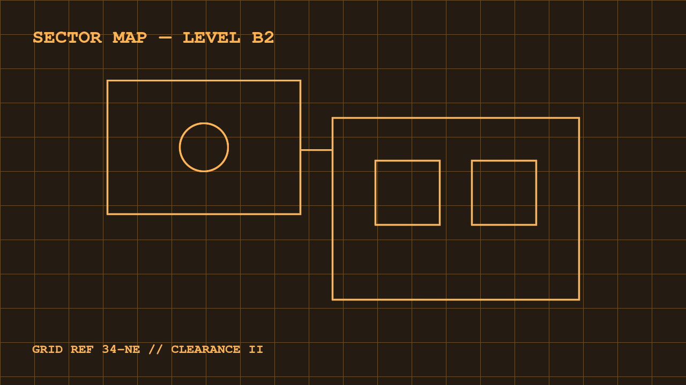

Amber and green monochrome monitors aren't a movie invention — they were
real hardware in the 70s and 80s. P3 phosphor glowed amber, P1 glowed
green. Amber was considered easier on the eyes, and in parts of Europe
it was even the standard for office workstations.

## A post with photos

This is a demo post with images. Note that any picture in a post is
automatically tinted to match the current theme — press `T` to switch
themes and watch the "photos" change color.

Images live next to the posts in `src/content/blog/images/` and are
embedded with regular Markdown syntax. Astro optimizes them at build
time.

## Some hardware trivia

| Phosphor | Color | Typical use             |
| -------- | ----- | ----------------------- |
| P1       | Green | Oscilloscopes, VT220    |
| P3       | Amber | Office terminals        |
| P4       | White | TVs, later CRTs         |

These screens refreshed slowly and the phosphor was "slow" too: a
cursor left a visible trail as it faded. That's the famous afterglow
this template imitates with shadows and animation.

## Why it still looks good

Constraints breed style. One color, one font, an 8×16 pixel grid — a
design system where it's hard to make something ugly. That's why the
best fictional terminals look convincing: they follow the rules of real
hardware.
